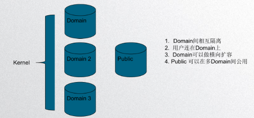
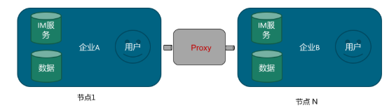
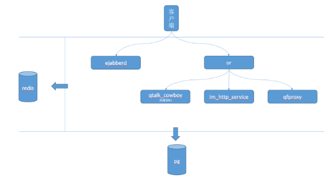

# Startalk(星语)——一站式通信解决方案

沟通是人类最基础的需求——《人类简史》

Startalk 的目标是成为一款通用的，高性能的企业级im套件。也在努力改变当前大型im系统无完整开源解决方案的现状。

Startalk 前身是去哪儿的Qtalk，已在Qunar稳定运行3年多。

其内核也在去哪儿旅行和去哪儿网站上扮演着着客服服务工具的角色。

也就是说，一套内核同时为去哪儿网提供了内部企业办公和商家tob业务的支撑。


# 我们的使用场景
* 办公自动化OA
* 商业企业客服系统
* 各种im场景的SDK级嵌入

# 系统自有特点
* 开放源代码

```comment
我们正在逐步把工作重心从公司git转移到github上，希望可以为大家提供更稳定持久的服务。
```
* 我们推荐私有化部署

```comment
企业有私有化部署的理由和需求，我们也是希望帮助企业甚至团体在满足高效沟通和足够的扩展性上提供尽可能多的帮助。
```

## 部署环境要求
-   [后端](https://github.com/qunarcorp/ejabberd-open)服务器centos 7(未来会支持ubuntu,以及各种私有云)
-   [ios SDK](https://github.com/qunarcorp/imsdk-ios)  最低支持iOS9系统
-   最低[Android SDK](https://github.com/qunarcorp/imsdk-android)：
SDK要求最低API级别为16
-   编译[Android SDK](https://github.com/qunarcorp/imsdk-android)： SDK要求您针对API 26或更高版本进行编译
-   其他平台均可使用C++14进行编译。界面是[qt](https://qt.io/)

### 看到这里，您现在可能已经希望测试一番了。。。

## 快速开始
* [ejabberd](https://github.com/qunarcorp/ejabberd-open)  后端源码及介绍

* [imsdk-android](https://github.com/qunarcorp/imsdk-android) 安卓源码及介绍

* [imsdk-iOS](https://github.com/qunarcorp/imsdk-ios) iOS 源码及介绍

如果您不想费事，或者希望可以快速开始，那么可以进入我们的[官方网站](https://im.qunar.com/new/)注册公共域账号进行测试。

## [官方网站](https://im.qunar.com/new/)
我们针对不同层次的客户提供了不同层次的支持方式。
如果您感兴趣但是担心各种使用上的问题，可以移步[官网](https://im.qunar.com/new/)了解详情

## 系统特性

* 注重您的使用体验和信息安全
* 支持端到端加密方式。默认使用TLS连接，纯二进制协议
* 支持所有的消息类型，文本、表情、文件、音视频、图片、位置、红包、代码……；
* 支持全平台接入；
* 采用去中心化设计。支持私有云或公有云部署

## 用户（已在生产环境使用）

目前已广泛使用的主要厂商，如去哪儿、北工大、便利蜂、新晨航空、爱云动


### 包括以下扩展功能
-   企业OA
-   单聊及群聊
-   搜索
-   push
-   音视频
-   红包&AA收款
-   会话加密
-   组织架构


## 去中心化设计及部署方式


Startalk 采用去中心化设计，将非状态服务合并到了Public中，状态服务进入了Domain中。Domain横向扩展，相互之间隔离



去中心化部署，只要有服务器，自己家里都能部署一套im服务


Startalk 后端模块



+ [ejabberd](https://github.com/qunarcorp/ejabberd-open)

IM核心组件，负责维持与客户端的长连接和消息路由

+ [or](https://github.com/qunarcorp/or_open)

IM负载均衡组件，负责验证客户端身份，以及转发http请求到对应的后台服务
+ [im_http_service](https://github.com/qunarcorp/im_http_service_open)

IM HTTP接口服务，负责IM相关数据的查询、设置以及历史消息同步

+ [qtalk_cowboy](https://github.com/qunarcorp/qtalk_cowboy_open)(后面所有的接口都会迁移到im_http_service，这个服务会废弃)

IM HTTP接口服务，负责IM相关数据的查询、设置以及历史消息同步，后面会全部迁移到im_http_service上

+ [qfproxy](https://github.com/qunarcorp/qfproxy_open)

IM文件服务，负责文件的上传和下载

+ [qtalk_search](https://github.com/qunarcorp/qtalk_search)

提供远程搜索人员和群的服务

+ redis

IM缓存服务

+ postgresql

IM数据库服务

### 客户端简介
> 客户端SDK开源，目前仅开源移动端，PC端即将开源

#### android端
+ [imsdk-android](https://github.com/qunarcorp/imsdk-android)

安卓SDK

#### ios端
+ [imsdk-iOS](https://github.com/qunarcorp/imsdk-ios)

ios SDK

+ [libqimkit-ios-cook ](https://github.com/qunarcorp/libqimkit-ios-cook)

各个组件Pod库

+ [libqimcommoncategories](https://github.com/qunarcorp/libqimcommoncategories-ios)

扩展工具组件库

+ [libqimdatabase](https://github.com/qunarcorp/libqimdatabase-ios)

数据库组件库

+ [libqimopenssl](https://github.com/qunarcorp/libqimopenssl-ios)

适用于iOS/Mac的OpenSSL库


>PC及MAC端即将开源，如有需要，可先行下载客户端自主部署,下载地址:[https://im.qunar.com/new/#/download](https://im.qunar.com/new/#/download)
